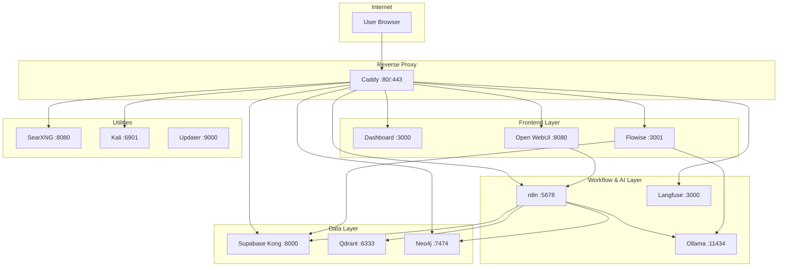
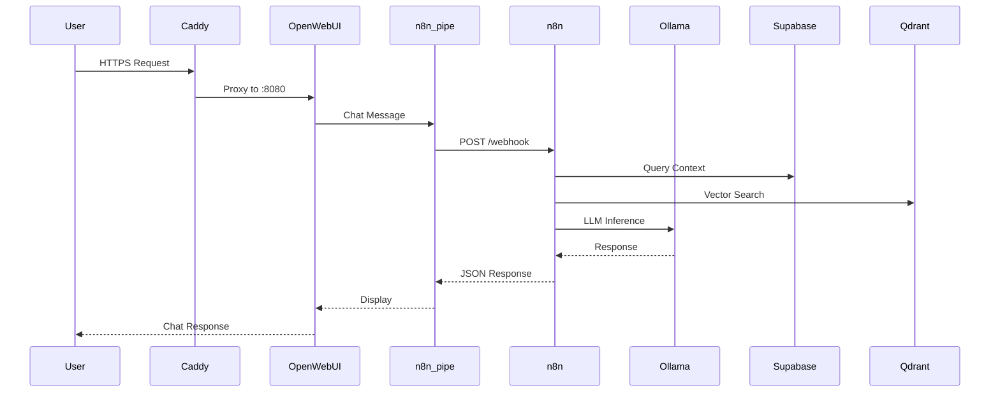

# CBass - Self-Hosted AI Stack

**CBass** is a self-hosted AI Docker Compose orchestration platform that combines AI and database services into a cohesive local infrastructure stack with automatic HTTPS via Caddy.

> Fork of [coleam00/local-ai-packaged](https://github.com/coleam00/local-ai-packaged), which itself builds on [n8n-io/self-hosted-ai-starter-kit](https://github.com/n8n-io/self-hosted-ai-starter-kit)

**Live Deployment**: [cbass.space](https://cbass.space)

## Features

- **n8n** - Visual workflow automation with 400+ integrations
- **Open WebUI** - ChatGPT-style interface for local LLMs
- **Supabase** - PostgreSQL database with pgvector for embeddings
- **Ollama** - Local LLM inference (Llama, Qwen, etc.)
- **Flowise** - No-code AI agent builder
- **Qdrant** - High-performance vector database
- **Neo4j** - Knowledge graph database
- **Langfuse** - LLM observability and tracing
- **SearXNG** - Privacy-respecting meta search engine
- **Kali Linux** - Browser-based security desktop (KasmWeb)
- **Caddy** - Automatic HTTPS with Let's Encrypt

---

## Architecture



---

## Request Flow

The primary user flow routes chat messages from Open WebUI through n8n for AI agent processing:



---

## Service Inventory

### Core Services

| Service | Container | Internal Port | Purpose |
|---------|-----------|---------------|---------|
| **Dashboard** | dashboard | 3000 | Next.js AI Command Center |
| **n8n** | n8n | 5678 | Workflow automation & AI agents |
| **Open WebUI** | open-webui | 8080 | Chat interface for LLMs |
| **Flowise** | flowise | 3001 | Visual no-code AI builder |
| **Ollama** | ollama | 11434 | Local LLM inference |

### Data Layer

| Service | Container | Internal Port | Purpose |
|---------|-----------|---------------|---------|
| **Supabase Kong** | kong | 8000 | API Gateway |
| **Supabase DB** | db | 5432 | PostgreSQL + pgvector |
| **Qdrant** | qdrant | 6333, 6334 | Vector database (HTTP/gRPC) |
| **Neo4j** | neo4j | 7474, 7687 | Graph database (Browser/Bolt) |

### Observability

| Service | Container | Internal Port | Purpose |
|---------|-----------|---------------|---------|
| **Langfuse Web** | langfuse-web | 3000 | LLM tracing UI |
| **Langfuse Worker** | langfuse-worker | 3030 | Background processing |
| **ClickHouse** | clickhouse | 8123, 9000 | Analytics database |
| **MinIO** | minio | 9000, 9001 | S3-compatible storage |

### Utilities

| Service | Container | Internal Port | Purpose |
|---------|-----------|---------------|---------|
| **SearXNG** | searxng | 8080 | Meta search engine |
| **Redis** | redis | 6379 | Cache (Valkey) |
| **Kali** | kali | 6901 | Browser-based Kali desktop |
| **Updater** | updater | 9000 | Webhook container updates |
| **Caddy** | caddy | 80, 443 | Reverse proxy with auto-TLS |

### Supabase Components

| Service | Container | Internal Port | Purpose |
|---------|-----------|---------------|---------|
| **Kong** | kong | 8000, 8443 | API Gateway |
| **GoTrue** | auth | 9999 | Authentication |
| **PostgREST** | rest | 3000 | REST API |
| **Realtime** | realtime | 4000 | WebSocket subscriptions |
| **Storage** | storage | 5000 | File storage |
| **Studio** | studio | 3000 | Dashboard UI |
| **Supavisor** | pooler | 6543 | Connection pooler |

---

## Port Reference

| Port | Service | Protocol | Notes |
|------|---------|----------|-------|
| 80 | Caddy | HTTP | Redirects to 443 |
| 443 | Caddy | HTTPS | Main entry point |
| 3000 | Dashboard / Langfuse / Studio | HTTP | Multiple services share port internally |
| 3001 | Flowise | HTTP | Visual AI builder |
| 5432 | PostgreSQL | TCP | Database |
| 5678 | n8n | HTTP | Workflow engine |
| 6333 | Qdrant | HTTP | Vector DB REST API |
| 6334 | Qdrant | gRPC | Vector DB gRPC |
| 6379 | Redis/Valkey | TCP | Cache |
| 6543 | Supavisor | TCP | Connection pooler |
| 6901 | Kali | HTTPS | VNC/noVNC (KasmWeb) |
| 7474 | Neo4j | HTTP | Browser UI |
| 7687 | Neo4j | Bolt | Graph queries |
| 8000 | Kong | HTTP | Supabase API Gateway |
| 8080 | Open WebUI / SearXNG | HTTP | Multiple services share port internally |
| 8123 | ClickHouse | HTTP | Analytics queries |
| 9000 | MinIO / Updater / ClickHouse | HTTP | Multiple services share port internally |
| 9001 | MinIO Console | HTTP | S3 management UI |
| 11434 | Ollama | HTTP | LLM API |

---

## Subdomain Routing (Production)

| Subdomain | Target Service | Internal Port |
|-----------|----------------|---------------|
| `cbass.space` | dashboard | 3000 |
| `www.cbass.space` | (redirect to cbass.space) | - |
| `n8n.cbass.space` | n8n | 5678 |
| `openwebui.cbass.space` | open-webui | 8080 |
| `flowise.cbass.space` | flowise | 3001 |
| `supabase.cbass.space` | kong | 8000 |
| `langfuse.cbass.space` | langfuse-web | 3000 |
| `neo4j.cbass.space` | neo4j | 7474 |
| `searxng.cbass.space` | searxng | 8080 |
| `kali.cbass.space` | kali | 6901 |

---

## VPS vs Local Repository

| Component | VPS (cbass.space) | Local Repository | Notes |
|-----------|-------------------|------------------|-------|
| `dashboard/` | Running | Source code | Next.js app built in container |
| `scripts/` | Running | Source code | Webhook automation |
| Kali service | Running | In docker-compose.yml | KasmWeb desktop |
| Updater service | Running | In docker-compose.yml | Container updates |
| `.env` | Production secrets | Use `env.example` | Never committed |
| `supabase/` | Cloned at runtime | Auto-cloned on first run | Sparse checkout |
| `node_modules/` | Built in container | gitignored | |
| `searxng/` | Generated config | Auto-generated | Created on first run |

---

## Quick Start

### Prerequisites

- [Python 3.x](https://www.python.org/downloads/)
- [Docker Desktop](https://www.docker.com/products/docker-desktop/) or Docker + Docker Compose
- [Git](https://git-scm.com/)

### Installation

```bash
# Clone the repository
git clone https://github.com/mdc159/cbass.git
cd cbass

# Create environment file
cp env.example .env

# Edit .env with your secrets (see Environment Variables section)

# Start with NVIDIA GPU
python start_services.py --profile gpu-nvidia --environment private --open-dashboard

# Or start with CPU only
python start_services.py --profile cpu --environment private --open-dashboard
```

### Access Services

After startup, access services at:

| Service | URL |
|---------|-----|
| n8n | http://localhost:5678 |
| Open WebUI | http://localhost:8080 |
| Flowise | http://localhost:3001 |
| Supabase Studio | http://localhost:8000 |
| Neo4j Browser | http://localhost:7474 |
| Langfuse | http://localhost:3000 |

---

## Documentation

Start with [docs/README.md](./docs/README.md) for the full documentation index, including deployment, services, architecture, and operations guides.

Claude Code users can use `/onboard` or `/cbass-context` to load project context quickly (see [docs/README.md](./docs/README.md) and [CLAUDE.md](./CLAUDE.md)).

---

## Environment Variables

### Required Secrets

```bash
# n8n - generate with: openssl rand -hex 32
N8N_ENCRYPTION_KEY=
N8N_USER_MANAGEMENT_JWT_SECRET=

# Supabase - see: https://supabase.com/docs/guides/self-hosting/docker
POSTGRES_PASSWORD=          # No '@' character!
JWT_SECRET=
PG_META_CRYPTO_KEY=        # Reuse JWT_SECRET value if desired
ANON_KEY=
SERVICE_ROLE_KEY=
DASHBOARD_USERNAME=
DASHBOARD_PASSWORD=
POOLER_TENANT_ID=
NEXT_PUBLIC_SUPABASE_URL=  # e.g. http://localhost:8000
NEXT_PUBLIC_SUPABASE_ANON_KEY=  # same value as ANON_KEY

# Neo4j
NEO4J_AUTH=neo4j/your_password

# Langfuse
CLICKHOUSE_PASSWORD=
MINIO_ROOT_PASSWORD=
LANGFUSE_SALT=
NEXTAUTH_SECRET=
ENCRYPTION_KEY=             # generate with: openssl rand -hex 32
```

### Production Hostnames

```bash
# Uncomment and set for production deployment
N8N_HOSTNAME=n8n.yourdomain.com
WEBUI_HOSTNAME=openwebui.yourdomain.com
FLOWISE_HOSTNAME=flowise.yourdomain.com
SUPABASE_HOSTNAME=supabase.yourdomain.com
LANGFUSE_HOSTNAME=langfuse.yourdomain.com
NEO4J_HOSTNAME=neo4j.yourdomain.com
SEARXNG_HOSTNAME=searxng.yourdomain.com
KALI_HOSTNAME=kali.yourdomain.com
LETSENCRYPT_EMAIL=your@email.com
```

### Optional Configuration

```bash
# Flowise authentication
FLOWISE_USERNAME=
FLOWISE_PASSWORD=

# SearXNG workers
SEARXNG_UWSGI_WORKERS=4
SEARXNG_UWSGI_THREADS=4

# Google OAuth for Supabase
ENABLE_GOOGLE_SIGNUP=true
GOOGLE_CLIENT_ID=
GOOGLE_CLIENT_SECRET=
```

---

## Directory Structure

```
CBass/
├── start_services.py           # Main entry point
├── docker-compose.yml          # Service definitions
├── docker-compose.override.private.yml  # Dev mode (ports exposed)
├── docker-compose.override.public.yml   # Prod mode (only 80/443)
├── Caddyfile                   # Reverse proxy routing
├── n8n_pipe.py                 # Open WebUI → n8n bridge
├── env.example                 # Environment template
│
├── dashboard/                  # Next.js AI Command Center
│   ├── app/                   # App router pages
│   ├── components/            # UI components (shadcn/ui)
│   ├── public/                # Static assets
│   └── Dockerfile             # Container build
│
├── scripts/                    # Webhook automation
│   ├── hooks.json             # Webhook configuration
│   └── update-container.sh    # Container update script
│
├── n8n/backup/                 # Pre-built RAG workflows
│   ├── workflows/
│   └── credentials/
│
├── flowise/                    # Flowise tools & chatflows
├── neo4j/                      # Neo4j data/logs/plugins
├── searxng/                    # SearXNG config (generated)
├── supabase/                   # Auto-cloned on first run
└── shared/                     # Shared files accessible from n8n
```

---

## Deployment Profiles

### GPU Profiles

| Profile | Command | Use Case |
|---------|---------|----------|
| `gpu-nvidia` | `--profile gpu-nvidia` | NVIDIA GPU with CUDA |
| `gpu-amd` | `--profile gpu-amd` | AMD GPU with ROCm (Linux) |
| `cpu` | `--profile cpu` | CPU-only inference |
| `none` | `--profile none` | External LLM API only |

### Environment Modes

| Mode | Command | Behavior |
|------|---------|----------|
| `private` | `--environment private` | All ports exposed locally (default) |
| `public` | `--environment public` | Only ports 80/443 via Caddy |

### Startup Convenience Flags

| Flag | Default | Behavior |
|------|---------|----------|
| `--open-dashboard` | off | Opens dashboard in your default browser after startup |
| `--dashboard-url <url>` | `http://localhost:3002` | URL used when `--open-dashboard` is enabled |

### Examples

```bash
# Local development with NVIDIA GPU
python start_services.py --profile gpu-nvidia --environment private --open-dashboard

# Production deployment
python start_services.py --profile gpu-nvidia --environment public

# CPU-only development
python start_services.py --profile cpu

# Use external API (no local Ollama)
python start_services.py --profile none

# Open a custom dashboard URL after startup
python start_services.py --profile none --environment private --open-dashboard --dashboard-url http://localhost:3002
```

---

## Common Operations

```bash
# Check service status
docker compose -p localai ps

# View logs for a service
docker compose -p localai logs -f n8n
docker compose -p localai logs -f open-webui

# Restart a specific service
docker compose -p localai restart n8n

# Stop all services
docker compose -p localai down

# Update all containers
docker compose -p localai -f docker-compose.yml --profile <your-profile> pull
python start_services.py --profile <your-profile>
```

---

## Pre-built Workflows

### n8n RAG Agents

Located in `n8n/backup/workflows/`:

- `V1_Local_RAG_AI_Agent.json` - Basic RAG with local LLM
- `V2_Local_Supabase_RAG_AI_Agent.json` - RAG using Supabase vectors
- `V3_Local_Agentic_RAG_AI_Agent.json` - Advanced agentic RAG

### Flowise Tools

Located in `flowise/`:

- Google Docs creation
- PostgreSQL queries
- Slack integration
- Web search tools

---

## Open WebUI + n8n Integration

The `n8n_pipe.py` script bridges Open WebUI to n8n webhooks:

1. Start services and create an n8n account at http://localhost:5678
2. Import a workflow from `n8n/backup/workflows/`
3. Activate the workflow and copy the Production webhook URL
4. In Open WebUI, go to **Workspace → Functions → Add Function**
5. Paste the code from `n8n_pipe.py`
6. Click the gear icon and set `n8n_url` to your webhook URL
7. Enable the function - it appears in the model dropdown

Also available at: [openwebui.com/f/coleam/n8n_pipe](https://openwebui.com/f/coleam/n8n_pipe/)

---

## Cloud Deployment

### Prerequisites

- Linux server (Ubuntu recommended)
- Docker and Docker Compose installed
- Domain with DNS access

### Steps

1. Open firewall ports:
   ```bash
   ufw enable
   ufw allow 80 && ufw allow 443
   ufw reload
   ```

2. Clone and configure:
   ```bash
   git clone https://github.com/mdc159/cbass.git
   cd cbass
   cp env.example .env
   # Edit .env with production hostnames and secrets
   ```

3. Set up DNS A records pointing your subdomains to your server IP

4. Start in public mode:
   ```bash
   python3 start_services.py --profile gpu-nvidia --environment public
   ```

---

## Troubleshooting

### Supabase Issues

- **Pooler Restarting**: See [GitHub issue #30210](https://github.com/supabase/supabase/issues/30210#issuecomment-2456955578)

- **Analytics Startup Failure**: After changing Postgres password, delete `supabase/docker/volumes/db/data`

- **Service Unavailable**: Ensure no `@` character in `POSTGRES_PASSWORD` - this breaks URI parsing

- **Files Not Found**: Delete the `supabase/` folder and re-run `start_services.py` to re-clone

### SearXNG Issues

- **Container Restarting**: Set permissions: `chmod 755 searxng`

### GPU Issues

- **Windows GPU**: Enable WSL 2 backend in Docker Desktop. See [Docker GPU docs](https://docs.docker.com/desktop/features/gpu/)

- **Linux GPU**: Follow [Ollama Docker instructions](https://github.com/ollama/ollama/blob/main/docs/docker.md)

### Docker Desktop

- Enable "Expose daemon on tcp://localhost:2375 without TLS" in settings

---

## Credential Configuration

When setting up n8n credentials:

| Service | Host | Port | Notes |
|---------|------|------|-------|
| Ollama | `ollama` | 11434 | `http://ollama:11434` |
| PostgreSQL | `db` | 5432 | Use container name, not localhost |
| Qdrant | `qdrant` | 6333 | `http://qdrant:6333` |
| Neo4j | `neo4j` | 7687 | Bolt protocol |

### Mac Users Running Ollama Locally

If running Ollama outside Docker on Mac:

1. Set `OLLAMA_HOST=host.docker.internal:11434` in n8n service environment
2. Update n8n Ollama credential to use `http://host.docker.internal:11434/`

---

## Resources

- [n8n AI Agents Tutorial](https://blog.n8n.io/ai-agents/)
- [n8n AI Workflow Guide](https://docs.n8n.io/advanced-ai/intro-tutorial/)
- [Vector Databases Explained](https://docs.n8n.io/advanced-ai/examples/understand-vector-databases/)
- [n8n AI Templates](https://n8n.io/workflows/?categories=AI)

---

## License

This project is licensed under the Apache License 2.0 - see the [LICENSE](LICENSE) file for details.

### Attribution

- Original: [n8n-io/self-hosted-ai-starter-kit](https://github.com/n8n-io/self-hosted-ai-starter-kit)
- Enhanced by: [coleam00/local-ai-packaged](https://github.com/coleam00/local-ai-packaged)
- This fork: [mdc159/cbass](https://github.com/mdc159/cbass)
