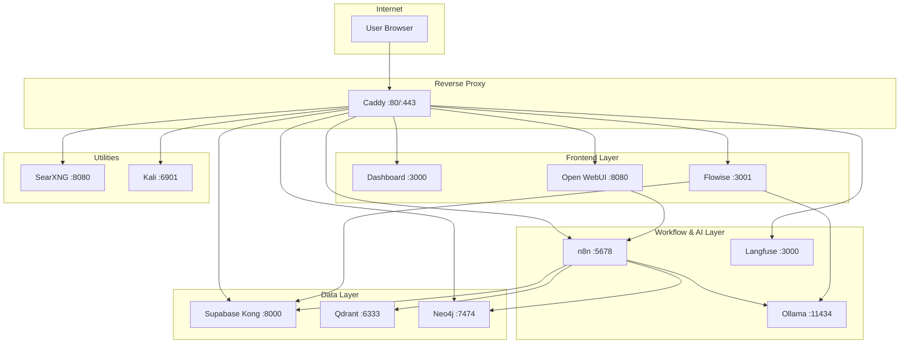
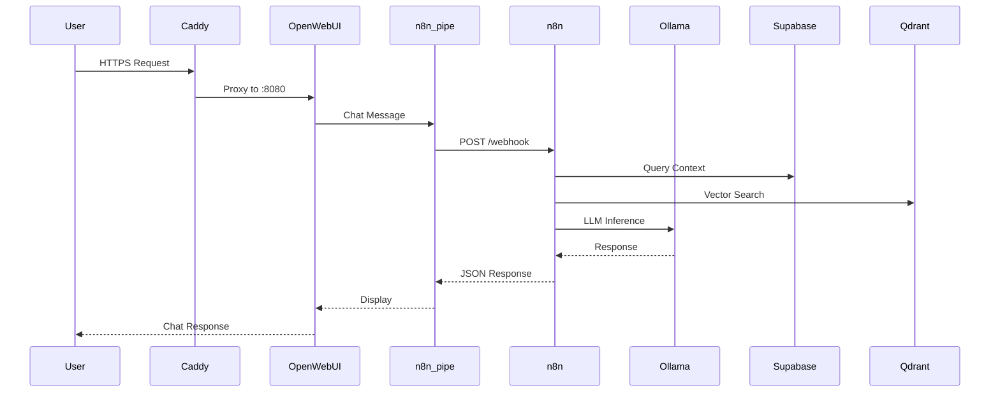
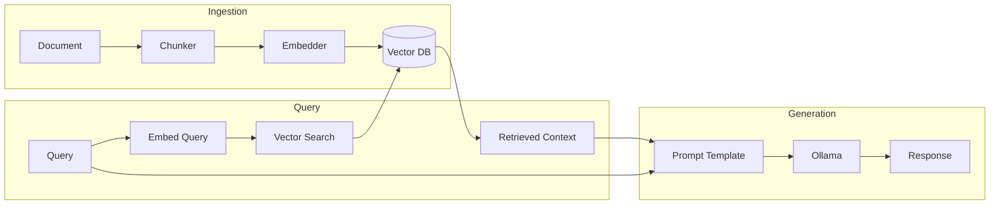
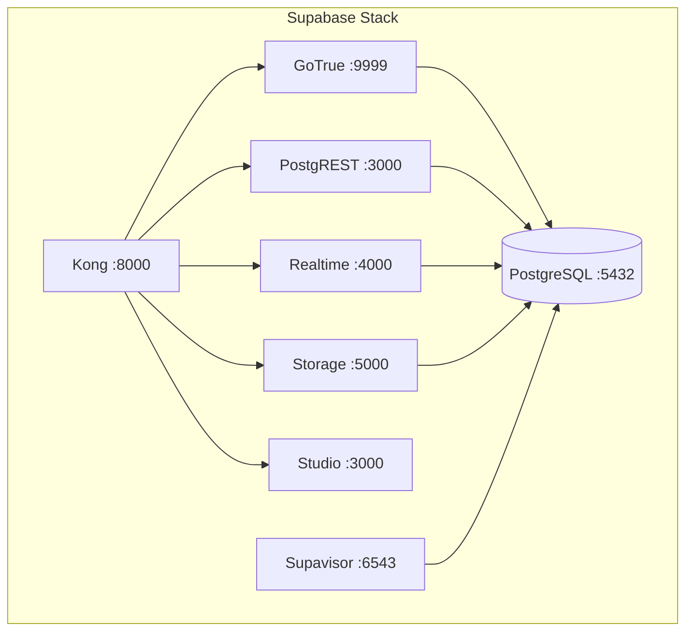

# Architecture Diagrams

Visual representations of CBass architecture.

## High-Level Architecture



## Request Flow



## RAG Pipeline



## Network Architecture

```
┌─────────────────────────────────────────────────────────────┐
│                      Internet                                │
│                         │                                   │
│                    [Firewall]                               │
│                    80, 443 only                             │
└─────────────────────────────────────────────────────────────┘
                          │
                          ▼
┌─────────────────────────────────────────────────────────────┐
│                    Caddy :80/:443                            │
│              (TLS Termination, Routing)                      │
└─────────────────────────────────────────────────────────────┘
                          │
          ┌───────────────┼───────────────┐
          ▼               ▼               ▼
┌─────────────────────────────────────────────────────────────┐
│              Docker Network: localai_default                 │
│                                                             │
│  ┌──────────┐ ┌──────────┐ ┌──────────┐ ┌──────────┐       │
│  │   n8n    │ │ flowise  │ │ open-    │ │ ollama   │       │
│  │  :5678   │ │  :3001   │ │  webui   │ │  :11434  │       │
│  └──────────┘ └──────────┘ │  :8080   │ └──────────┘       │
│                            └──────────┘                     │
│  ┌──────────┐ ┌──────────┐ ┌──────────┐ ┌──────────┐       │
│  │ supabase │ │  qdrant  │ │  neo4j   │ │ searxng  │       │
│  │   kong   │ │  :6333   │ │  :7474   │ │  :8080   │       │
│  │  :8000   │ └──────────┘ │  :7687   │ └──────────┘       │
│  └──────────┘              └──────────┘                     │
│                                                             │
└─────────────────────────────────────────────────────────────┘
```

## Supabase Architecture



## Data Flow Patterns

### Chat with Context (RAG)

```
1. User asks question
2. Question → Embedding model → Vector
3. Vector → Qdrant search → Similar documents
4. Documents + Question → Prompt template
5. Prompt → Ollama → Response
6. Response → User
```

### Knowledge Graph Query

```
1. User asks about relationships
2. Extract entities from question
3. Query Neo4j graph
4. Traverse relationships
5. Combine graph data with LLM response
6. Enriched answer → User
```

### Automated Workflow

```
1. Trigger (webhook, schedule, etc.)
2. n8n executes workflow nodes
3. Nodes interact with:
   - Ollama (AI processing)
   - Supabase (data storage)
   - External APIs
4. Output to destination
```

## Deployment Modes

### Private (Development)

```
localhost:5678 → n8n
localhost:8080 → Open WebUI
localhost:3001 → Flowise
... all ports exposed
```

### Public (Production)

```
*.cbass.space → Caddy :443 → Internal services
                    │
                    ├── n8n.cbass.space → n8n:5678
                    ├── openwebui.cbass.space → open-webui:8080
                    ├── flowise.cbass.space → flowise:3001
                    └── ... etc
```
