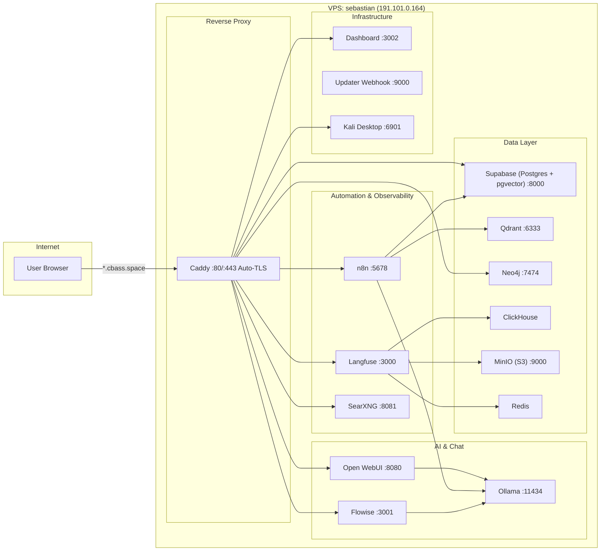
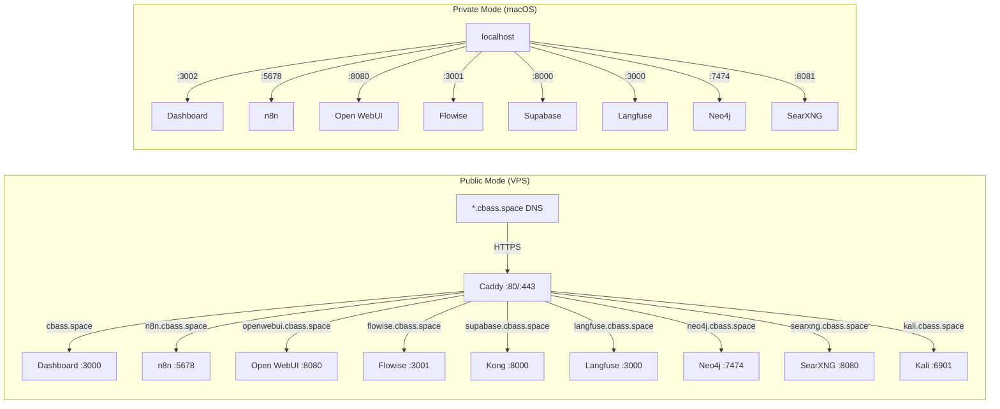
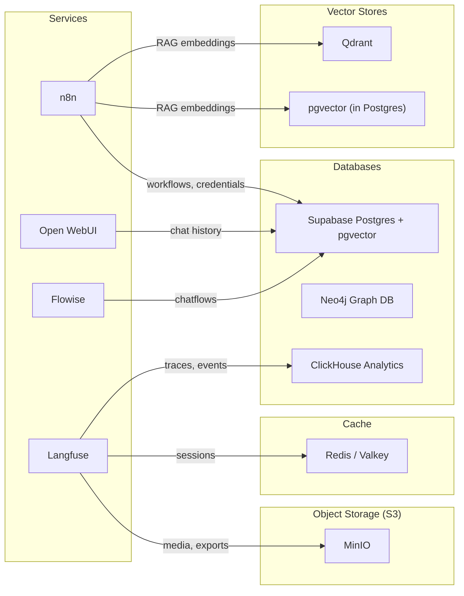
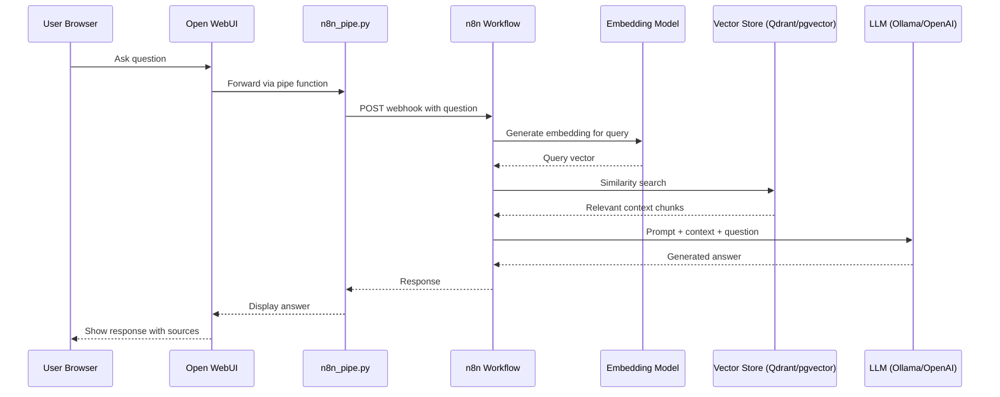
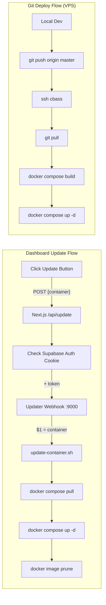
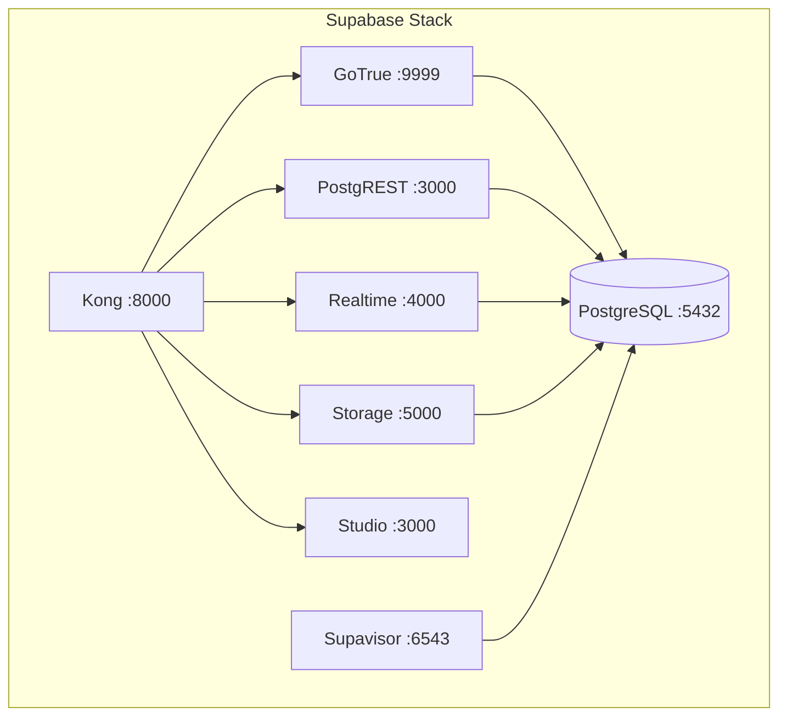

# Architecture Diagrams

Visual representations of CBass architecture. Each diagram is also available as an editable FigJam board (links below).

## 1. System Overview

**[Open in FigJam](https://www.figma.com/online-whiteboard/create-diagram/abb94d8c-9106-4f76-9cab-8aaabfc378c6?utm_source=other&utm_content=edit_in_figjam)**

All services grouped by purpose: AI/Chat, Automation/Observability, Data, and Infrastructure.

## 2. Network and Routing

**[Open in FigJam](https://www.figma.com/online-whiteboard/create-diagram/94d4e52b-cd6c-4bc3-8b53-ff454169d240?utm_source=other&utm_content=edit_in_figjam)**

Public mode routes through Caddy with auto-TLS. Private mode binds directly to localhost ports.

### Subdomain Routing Table

| Subdomain | Container | Internal Port |
|-----------|-----------|---------------|
| `cbass.space` | dashboard | :3000 |
| `n8n.cbass.space` | n8n | :5678 |
| `openwebui.cbass.space` | open-webui | :8080 |
| `flowise.cbass.space` | flowise | :3001 |
| `supabase.cbass.space` | kong | :8000 |
| `langfuse.cbass.space` | langfuse-web | :3000 |
| `neo4j.cbass.space` | neo4j | :7474 |
| `searxng.cbass.space` | searxng | :8080 |
| `kali.cbass.space` | kali | :6901 |

## 3. Data and Storage Layer

**[Open in FigJam](https://www.figma.com/online-whiteboard/create-diagram/040aa88a-f9b6-46ab-9c50-2b943ccd8993?utm_source=other&utm_content=edit_in_figjam)**

All persistent data stores, which services use them, and their Docker volume mappings.

### Docker Named Volumes

| Volume | Container | Mount Path | Purpose |
|--------|-----------|------------|---------|
| `n8n_storage` | n8n | `/home/node/.n8n` | Workflows, credentials, execution data |
| `ollama_storage` | ollama | `/root/.ollama` | Downloaded model weights |
| `qdrant_storage` | qdrant | `/qdrant/storage` | Vector embeddings and indexes |
| `open-webui` | open-webui | app data | Chat history, user settings |
| `flowise` | flowise | `/root/.flowise` | Chatflow definitions, uploads |
| `langfuse_postgres_data` | langfuse-db | `/var/lib/postgresql/data` | Langfuse traces and metadata |
| `langfuse_clickhouse_data` | clickhouse | `/var/lib/clickhouse` | Analytics events |
| `langfuse_minio_data` | minio | `/data` | S3-compatible object storage (media, exports) |
| `caddy-data` | caddy | `/data` | TLS certificates |
| `caddy-config` | caddy | `/config` | Caddy config state |
| `valkey-data` | redis | data | Session cache |
| `kali-data` | kali | `/home/kasm-user` | Kali user home directory |
| `kali-tools` | kali | tools | Installed security tools |

## 4. AI Request Flow (RAG Pipeline)

**[Open in FigJam](https://www.figma.com/online-whiteboard/create-diagram/fbfa2642-2f77-46d3-8e9a-fe6c35659bfd?utm_source=other&utm_content=edit_in_figjam)**

The path of a user question through the RAG pipeline.

### Ollama Configuration (Apple Silicon)

On macOS, Ollama runs natively via Homebrew (not in Docker) for Metal GPU access:

| Setting | Value | Purpose |
|---------|-------|---------|
| Flash attention | On | Faster inference |
| KV cache | q8_0 | Halves memory vs fp16 |
| Context window | 8192 | Default context length |
| Max loaded models | 2 | Concurrent model limit |
| Model storage | `/Volumes/Storage` | External SSD |

Services reach Ollama via `host.docker.internal:11434` (macOS) or `ollama:11434` (Docker/VPS).

## 5. Update and Deploy Pipeline

**[Open in FigJam](https://www.figma.com/online-whiteboard/create-diagram/22db788a-33fa-495f-84c7-4a22320f3bba?utm_source=other&utm_content=edit_in_figjam)**

Two deployment paths: dashboard buttons for container updates, git for code changes.

### Updatable Services

| Service | Container Name | Triggered By |
|---------|---------------|--------------|
| Open WebUI | `open-webui` | Dashboard button |
| n8n | `n8n` | Dashboard button |
| Flowise | `flowise` | Dashboard button |
| Langfuse | `langfuse-web` | Dashboard button |

The updater runs a custom Docker image (`scripts/Dockerfile`) with `bash`, `docker-cli`, and `docker-cli-compose`. The `COMPOSE_FILE` env var ensures recreated containers use the correct override file for their environment (private or public).

## Supabase Internal Architecture

