# CBass Architecture Diagram

## System Overview

```mermaid
graph TB
    subgraph Internet["🌐 Internet"]
        User["👤 User<br/>(Browser)"]
    end

    subgraph DNS["☁️ AWS Route 53 DNS"]
        DNS1["cbass.space<br/>→ 191.101.0.164"]
        DNS2["n8n.cbass.space<br/>→ 191.101.0.164"]
        DNS3["openwebui.cbass.space<br/>→ 191.101.0.164"]
        DNS4["flowise.cbass.space<br/>→ 191.101.0.164"]
        DNS5["supabase.cbass.space<br/>→ 191.101.0.164"]
        DNS6["+ 4 more subdomains"]
    end

    subgraph VPS["🖥️ Hostinger VPS (191.101.0.164)<br/>Ubuntu • 2 CPU • 7.5GB RAM"]
        subgraph Caddy["🔒 Caddy Reverse Proxy<br/>(Ports 80/443)"]
            SSL["Auto SSL/TLS<br/>Let's Encrypt + ZeroSSL"]
        end

        subgraph Frontend["🎨 Frontend Layer"]
            Dashboard["📊 Dashboard<br/>Next.js 15 + shadcn/ui<br/>Supabase Auth<br/>Dark/Light Mode"]
        end

        subgraph AI["🤖 AI Services"]
            N8N["⚙️ n8n<br/>Workflow Automation<br/>400+ Integrations"]
            OpenWebUI["💬 Open WebUI<br/>ChatGPT-like Interface<br/>Local LLM Chat"]
            Flowise["🔄 Flowise<br/>Visual AI Builder<br/>Drag & Drop Workflows"]
            Ollama["🧠 Ollama<br/>Local LLM Server<br/>qwen2.5:7b + nomic-embed"]
        end

        subgraph Data["💾 Data Layer"]
            Supabase["🗄️ Supabase (13 containers)<br/>━━━━━━━━━━━━━━━━<br/>Kong Gateway<br/>PostgreSQL Database<br/>Auth Service<br/>Storage Service<br/>Studio Dashboard<br/>REST API<br/>Realtime<br/>+ 6 more services"]
            Neo4j["🕸️ Neo4j<br/>Graph Database<br/>Knowledge Graphs"]
            Qdrant["📦 Qdrant<br/>Vector Database<br/>Embeddings & RAG"]
            Redis["⚡ Redis<br/>Cache Layer<br/>Session Storage"]
            Postgres["🐘 PostgreSQL<br/>Additional DB<br/>n8n Data"]
        end

        subgraph Monitoring["📊 Monitoring & Tools"]
            Langfuse["📈 Langfuse<br/>LLM Observability<br/>Trace & Monitor"]
            SearXNG["🔍 SearXNG<br/>Meta Search<br/>Privacy-Focused"]
        end
    end

    User -->|HTTPS| Caddy
    Caddy -->|Route by domain| Dashboard
    Caddy -->|Route by domain| N8N
    Caddy -->|Route by domain| OpenWebUI
    Caddy -->|Route by domain| Flowise
    Caddy -->|Route by domain| Supabase
    Caddy -->|Route by domain| Langfuse
    Caddy -->|Route by domain| Neo4j
    Caddy -->|Route by domain| SearXNG

    Dashboard -->|Auth| Supabase
    N8N -->|Execute| Ollama
    N8N -->|Store Data| Postgres
    N8N -->|Vector Search| Qdrant
    N8N -->|Graph Queries| Neo4j
    OpenWebUI -->|Chat| Ollama
    OpenWebUI -->|Webhooks| N8N
    Flowise -->|LLM Calls| Ollama
    Flowise -->|Vector Store| Qdrant
    Langfuse -->|Monitor| N8N
    Langfuse -->|Monitor| OpenWebUI
    SearXNG -->|Web Search| N8N

    style VPS fill:#1a1a2e,stroke:#16213e,stroke-width:3px,color:#fff
    style Caddy fill:#0f3460,stroke:#16213e,stroke-width:2px,color:#fff
    style Frontend fill:#16213e,stroke:#0f3460,stroke-width:2px,color:#fff
    style AI fill:#16213e,stroke:#0f3460,stroke-width:2px,color:#fff
    style Data fill:#16213e,stroke:#0f3460,stroke-width:2px,color:#fff
    style Monitoring fill:#16213e,stroke:#0f3460,stroke-width:2px,color:#fff
    style Dashboard fill:#e94560,stroke:#fff,stroke-width:2px,color:#fff
    style N8N fill:#ea5455,stroke:#fff,stroke-width:2px,color:#fff
    style OpenWebUI fill:#f07b3f,stroke:#fff,stroke-width:2px,color:#fff
    style Flowise fill:#ffd460,stroke:#fff,stroke-width:2px,color:#000
    style Ollama fill:#2d4059,stroke:#fff,stroke-width:2px,color:#fff
    style Supabase fill:#3aafa9,stroke:#fff,stroke-width:2px,color:#fff
    style Neo4j fill:#17c3b2,stroke:#fff,stroke-width:2px,color:#fff
    style Qdrant fill:#227c9d,stroke:#fff,stroke-width:2px,color:#fff
    style Langfuse fill:#6a4c93,stroke:#fff,stroke-width:2px,color:#fff
    style SearXNG fill:#8ac926,stroke:#fff,stroke-width:2px,color:#000
```

---

## Data Flow Diagram

```mermaid
flowchart LR
    subgraph User["👤 User Interaction"]
        Browser["Web Browser"]
    end

    subgraph Entry["🚪 Entry Point"]
        Caddy["Caddy<br/>Reverse Proxy<br/>+ SSL"]
    end

    subgraph UI["🎨 User Interfaces"]
        Dashboard["Dashboard<br/>Service Hub"]
        N8N_UI["n8n<br/>Workflow Editor"]
        WebUI["Open WebUI<br/>Chat Interface"]
        Flowise_UI["Flowise<br/>Visual Builder"]
    end

    subgraph Processing["⚙️ Processing Layer"]
        N8N_Engine["n8n Engine<br/>Workflow Execution"]
        Ollama_Engine["Ollama<br/>LLM Inference"]
    end

    subgraph Storage["💾 Storage Layer"]
        Vectors["Qdrant<br/>Vector Embeddings"]
        Graph["Neo4j<br/>Knowledge Graph"]
        DB["PostgreSQL<br/>Structured Data"]
        Auth["Supabase Auth<br/>User Sessions"]
    end

    Browser -->|HTTPS Request| Caddy
    Caddy -->|Route| Dashboard
    Caddy -->|Route| N8N_UI
    Caddy -->|Route| WebUI
    Caddy -->|Route| Flowise_UI
    
    Dashboard -->|Authenticate| Auth
    N8N_UI -->|Trigger| N8N_Engine
    WebUI -->|Send Message| Ollama_Engine
    WebUI -->|Webhook| N8N_Engine
    Flowise_UI -->|Execute| Ollama_Engine
    
    N8N_Engine -->|Query| Ollama_Engine
    N8N_Engine -->|Store| Vectors
    N8N_Engine -->|Query| Graph
    N8N_Engine -->|Save| DB
    
    Ollama_Engine -->|Generate| WebUI
    Vectors -->|Retrieve| N8N_Engine
    Graph -->|Relationships| N8N_Engine

    style Browser fill:#e94560,stroke:#fff,stroke-width:2px,color:#fff
    style Caddy fill:#0f3460,stroke:#fff,stroke-width:2px,color:#fff
    style Dashboard fill:#f07b3f,stroke:#fff,stroke-width:2px,color:#fff
    style N8N_UI fill:#ea5455,stroke:#fff,stroke-width:2px,color:#fff
    style WebUI fill:#ffd460,stroke:#fff,stroke-width:2px,color:#000
    style Ollama_Engine fill:#2d4059,stroke:#fff,stroke-width:2px,color:#fff
    style Vectors fill:#227c9d,stroke:#fff,stroke-width:2px,color:#fff
    style Graph fill:#17c3b2,stroke:#fff,stroke-width:2px,color:#fff
```

---

## Container Architecture

---

## Technology Stack

---

## Authentication Flow

---

## Deployment Architecture

---

## Service Interaction Map

---

## Quick Stats

| Category | Count | Details |
|----------|-------|---------|
| **Total Containers** | 29 | All running and healthy |
| **Web Services** | 4 | Dashboard, n8n, Open WebUI, Flowise |
| **AI Services** | 1 | Ollama (local LLM) |
| **Databases** | 4 | PostgreSQL, Neo4j, Qdrant, Redis |
| **Supabase Stack** | 13 | Complete backend platform |
| **Monitoring** | 5 | Langfuse + supporting services |
| **Infrastructure** | 2 | Caddy, SearXNG |
| **DNS Records** | 9 | All pointing to VPS |
| **SSL Certificates** | 9 | 1 active, 8 in progress |
| **Exposed Ports** | 2 | 80 (HTTP), 443 (HTTPS) |

---

## Color Legend

- 🔴 **Red/Pink** - User-facing interfaces
- 🟠 **Orange** - AI/ML services
- 🟡 **Yellow** - Interactive tools
- 🔵 **Blue** - Data storage
- 🟢 **Green** - Utilities
- 🟣 **Purple** - Monitoring
- ⚫ **Dark** - Infrastructure

---

**Created:** January 12, 2026  
**For:** Sebastian's AI Learning Platform  
**Purpose:** Visual reference for understanding the complete CBass architecture
