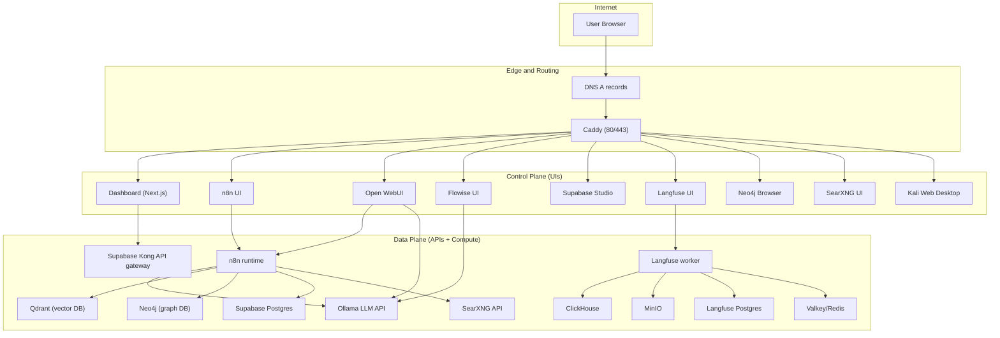
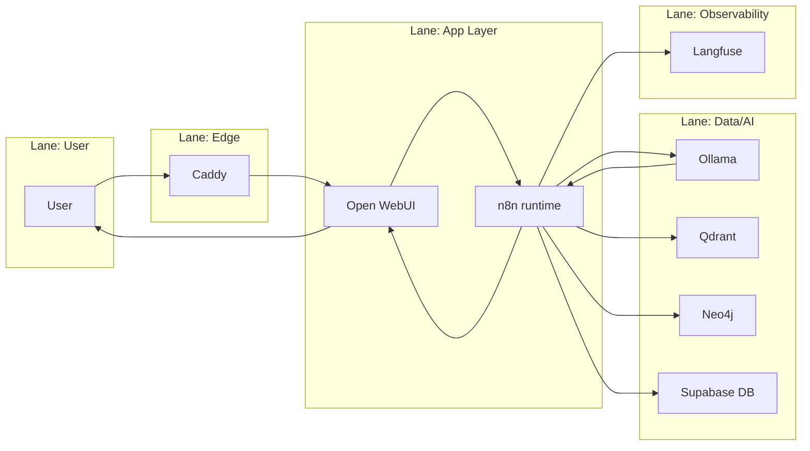
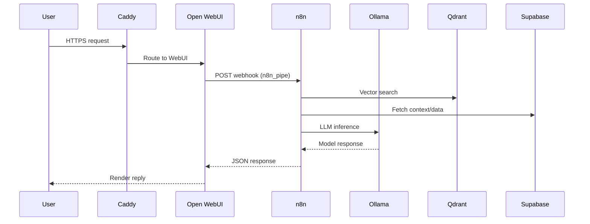
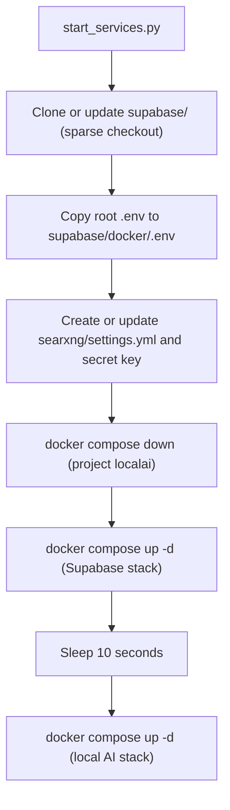
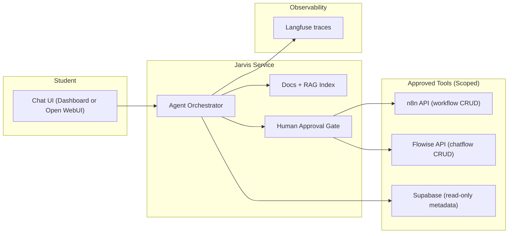
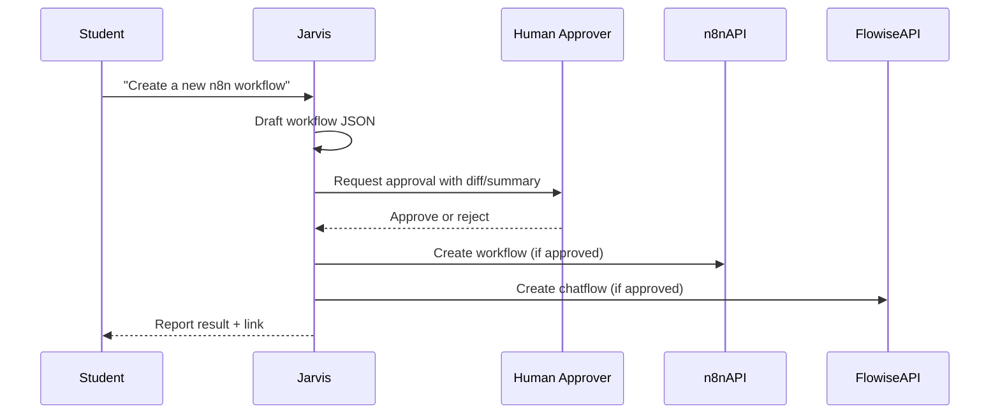

# CBass Architecture Map (Student Edition)

This document maps the services, ports, control planes, and data flows in CBass. It is designed to help a student understand how the system is structured and how requests move through it.

## Scope

- Covers the Docker Compose stack defined in `docker-compose.yml` and the Supabase stack included from `supabase/docker/docker-compose.yml`.
- Describes control plane (UIs and admin surfaces), data plane (runtime APIs and compute), observability plane, and ops plane.
- Includes diagrams and a port map for both private and public deployment modes.

## High-Level Overview

This diagram shows how external traffic enters through DNS and Caddy, then branches into control plane UIs and data plane APIs. It highlights that Caddy is the only public ingress and everything else stays inside the Docker network.

The significance is the separation of concerns: humans use UIs (control plane), while workflows and storage live in the data plane. This is the mental model students should use when tracing requests or diagnosing issues.

## Planes and Responsibilities

### Planes

- Control plane: human-facing UIs and admin tools.
- Data plane: service APIs and runtime compute.
- Observability plane: tracing, logging, and analytics.
- Ops plane: deployment scripts and update hooks.

### Plane Map

| Plane | Services | Notes |
|---|---|---|
| Control plane | Dashboard, n8n UI, Open WebUI, Flowise UI, Supabase Studio, Langfuse UI, Neo4j Browser, SearXNG UI, Kali Web | Mostly accessed through Caddy hostnames |
| Data plane | n8n runtime, Ollama, Qdrant, Neo4j, Supabase Kong, Supabase Postgres, Redis, SearXNG API | Internal container network `localai_default` |
| Observability | Langfuse worker+web, ClickHouse, MinIO | Tracing and event storage |
| Ops | `start_services.py`, `docker compose`, `updater` webhook | Deployment and update control |

## Service Catalog (Core Stack)

Legend:
- Internal port: container port on the Docker network.
- External: how it is reachable from outside.
- Storage: where persistent data lives (volume or bind mount).

| Service | Container | Internal port(s) | External access | Storage | Notes |
|---|---|---|---|---|---|
| Caddy | `caddy` | 80, 443, 2019 | Public 80/443 | `caddy-data`, `caddy-config` | Front door with TLS and routing |
| Dashboard | `dashboard` | 3000 | `cbass.space` | built in container | UI hub, uses Supabase auth |
| n8n | `n8n` | 5678 | `N8N_HOSTNAME` or `:8001` | `n8n_storage`, `./n8n/backup`, `./shared` | Workflow engine |
| Open WebUI | `open-webui` | 8080 | `WEBUI_HOSTNAME` or `:8002` | `open-webui` | Chat UI; can call n8n via `n8n_pipe.py` |
| Flowise | `flowise` | 3001 | `FLOWISE_HOSTNAME` or `:8003` | `~/.flowise` | Visual AI builder |
| Ollama | `ollama` | 11434 | `OLLAMA_HOSTNAME` or `:8004` | `ollama_storage` | Local LLM server |
| Qdrant | `qdrant` | 6333, 6334 | Internal only by default | `qdrant_storage` | Vector database |
| Neo4j | `neo4j` | 7473, 7474, 7687 | `NEO4J_HOSTNAME` or `:8008` | `./neo4j/*` | Graph database |
| Langfuse web | `langfuse-web` | 3000 | `LANGFUSE_HOSTNAME` or `:8007` | depends on worker/DB | Observability UI |
| Langfuse worker | `langfuse-worker` | 3030 | Internal only by default | depends on DB/MinIO | Background ingestion |
| ClickHouse | `clickhouse` | 8123, 9000, 9009 | Internal only by default | `langfuse_clickhouse_data`, `langfuse_clickhouse_logs` | Analytics storage |
| MinIO | `minio` | 9000, 9001 | Internal only by default | `langfuse_minio_data` | S3-compatible storage |
| Redis (Valkey) | `redis` | 6379 | Internal only by default | `valkey-data` | Cache used by Langfuse |
| SearXNG | `searxng` | 8080 | `SEARXNG_HOSTNAME` or `:8006` | `./searxng` | Metasearch |
| Kali Web | `kali` | 6901 | `KALI_HOSTNAME` or `:8009` | `kali-data`, `kali-tools` | Web desktop for learning |
| Updater | `updater` | 9000 | Internal only by default | `./scripts` | Webhook-driven updates |

## Service Catalog (Supabase Stack)

Supabase is auto-cloned into `supabase/` and uses its own compose file. Key containers and ports are summarized here.

| Service | Container | Internal port(s) | External access | Notes |
|---|---|---|---|---|
| Kong | `kong` | 8000, 8443 | `SUPABASE_HOSTNAME` or `:8005` | API gateway for Supabase |
| Postgres | `db` | 5432 | Internal by default | Main Supabase database |
| Auth | `auth` | 9999 | Internal by default | GoTrue auth service |
| REST | `rest` | 3000 | Internal by default | PostgREST API |
| Realtime | `realtime` | 4000 | Internal by default | WebSocket subscriptions |
| Storage | `storage` | 5000 | Internal by default | File storage API |
| Studio | `studio` | 3000 | Usually proxied via Kong | Supabase UI |
| Meta | `meta` | 8080 | Internal by default | Postgres meta API |
| Pooler | `supavisor` | 6543 | Internal by default | Connection pooler |
| Analytics | `analytics` | 4000 | Internal by default | Logflare/analytics |
| Edge functions | `functions` | 9000 | Internal by default | Edge runtime |
| Image proxy | `imgproxy` | 8080 | Internal by default | Image transformation |

## Port Map

### Internal ports (Docker network)

| Service | Port(s) | Purpose |
|---|---|---|
| Caddy | 80, 443 | Edge routing |
| Dashboard | 3000 | UI |
| n8n | 5678 | Workflow UI and API |
| Open WebUI | 8080 | Chat UI |
| Flowise | 3001 | UI |
| Ollama | 11434 | LLM API |
| Qdrant | 6333/6334 | Vector DB HTTP/gRPC |
| Neo4j | 7474/7687 | Browser/Bolt |
| Langfuse web/worker | 3000/3030 | UI + worker |
| ClickHouse | 8123/9000/9009 | Analytics DB |
| MinIO | 9000/9001 | S3 + console |
| Redis | 6379 | Cache |
| SearXNG | 8080 | Search |
| Kali | 6901 | Web desktop |
| Updater | 9000 | Webhook |

### External exposure by environment

- Private mode (`--environment private`): services are bound to `127.0.0.1` ports via `docker-compose.override.private.yml` for local access, plus Caddy 80/443.
- Public mode (`--environment public`): only Caddy 80/443 should be exposed. Supabase port bindings are removed via `docker-compose.override.public.supabase.yml`.
- Production domain routing: hostnames like `N8N_HOSTNAME`, `WEBUI_HOSTNAME`, etc are proxied by Caddy to internal services.

## Swim Lane: Chat Request Through the System

This swim lane groups the same request across layers, showing who is responsible at each step. The "App Layer" (Open WebUI and n8n) coordinates work, and the "Data/AI" lane performs the heavy lifting.

The significance is troubleshooting and teaching. If a response is wrong or slow, the lanes suggest where to look in order: edge, app, data, then observability.

## Sequence Diagram: Open WebUI to n8n RAG Flow

This sequence diagram zooms into the RAG path, showing the exact call order from the UI to n8n and then to Qdrant, Supabase, and Ollama. It is the most common "happy path" for a chat request that needs context.

The significance is latency and failure analysis. Each step is a potential bottleneck, and the diagram makes it clear where to add caching, retries, or richer observability.

## Flowchart: Startup Sequence

This flowchart captures the exact startup order enforced by `start_services.py`. Supabase comes first because other services depend on Postgres and Kong being ready before they can initialize correctly.

The significance is operational reliability. It explains why running `docker compose` directly can lead to missing config or startup race conditions.

## Control Plane Surfaces (UIs)

| UI | Purpose | Access |
|---|---|---|
| Dashboard | Service hub and auth | `cbass.space` |
| n8n UI | Workflow creation and management | `N8N_HOSTNAME` |
| Open WebUI | Chat UI for LLMs | `WEBUI_HOSTNAME` |
| Flowise UI | Visual AI builder | `FLOWISE_HOSTNAME` |
| Supabase Studio | DB/admin UI | usually via `SUPABASE_HOSTNAME` |
| Langfuse UI | Tracing and observability | `LANGFUSE_HOSTNAME` |
| Neo4j Browser | Graph exploration | `NEO4J_HOSTNAME` |
| SearXNG UI | Search interface | `SEARXNG_HOSTNAME` |
| Kali Web Desktop | Learning environment | `KALI_HOSTNAME` |

## Data Plane Endpoints (Internal DNS)

Examples of internal DNS usage from within containers:

- `http://ollama:11434` for LLM inference.
- `http://qdrant:6333` for vector search.
- `bolt://neo4j:7687` for graph queries.
- `postgres://postgres@db:5432` for n8n to Supabase DB.
- `http://searxng:8080` for search.
- `http://minio:9000` and `http://clickhouse:8123` for Langfuse storage.

## Storage and Persistence

### Named volumes

- `n8n_storage` for n8n state.
- `ollama_storage` for downloaded models.
- `qdrant_storage` for vector data.
- `open-webui` for WebUI data.
- `flowise` for Flowise data.
- `caddy-data` and `caddy-config` for TLS and config.
- `valkey-data` for Redis.
- `langfuse_postgres_data`, `langfuse_clickhouse_data`, `langfuse_clickhouse_logs`, `langfuse_minio_data`.
- `kali-data`, `kali-tools` for the Kali environment.

### Bind mounts

- `./n8n/backup` for workflow imports.
- `./shared` for shared files accessible in n8n.
- `./neo4j/*` for Neo4j data/logs/plugins.
- `./searxng` for SearXNG config.

## Control and Ops Tools

| Tool | Role | Where |
|---|---|---|
| `start_services.py` | Bootstraps Supabase, SearXNG, and stack start | repo root |
| `docker compose` | Lifecycle management | repo root |
| `Caddyfile` | Hostname routing | repo root |
| `scripts/update-container.sh` | Update webhook target | `scripts/` |
| `Scripts/hooks.json` | Webhook config for updates | `Scripts/` |

## Jarvis Agent: Structure and Minimum Access Model

The goal for "Jarvis" is twofold: teach the student how the stack works and safely assist with building workflows in n8n and Flowise. That means Jarvis belongs in the control plane (student interaction) but needs narrowly scoped access to a few data plane APIs.

This diagram shows Jarvis as a dedicated service that sits between the student and the tooling. Jarvis talks to documentation and to APIs, but any write actions go through an explicit approval gate.

The significance is least privilege. Jarvis can explain the system and draft workflows, but it cannot mutate the stack without a deliberate human check.

### Recommended structure

- Run Jarvis as its own container, separate from n8n and Flowise, with a non-root user.
- Provide a single chat surface (Dashboard or Open WebUI) and route all actions through a small tool layer.
- Give Jarvis a read-only docs index (`docs/`, `README.md`) with RAG so it can explain the architecture without "guessing."
- Log all Jarvis actions to Langfuse for traceability.

### Minimum required access

- n8n: API token scoped to workflow CRUD only; no credential or execution secrets.
- Flowise: API key scoped to chatflow import/update; no global admin.
- Supabase: read-only key for metadata and user education; avoid write privileges.
- No Docker socket access, no shell access, and no host filesystem mounts beyond docs.

### Workflow creation approach

- Jarvis drafts workflows as JSON and either:
  - opens a pull request in `n8n/backup/workflows`, or
  - creates a "staged" workflow via the n8n API and waits for approval.
- Flowise chatflows follow the same pattern using Flowise import APIs or JSON exports.

### Safety guardrails

- Require explicit approval before any write action.
- Enforce allowlists for target services, webhooks, and external domains.
- Reject requests that need broad credentials or unbounded filesystem access.

### Jarvis permissions matrix (minimum viable)

| Capability | Scope | Allowed? | Notes |
|---|---|---|---|
| Read docs (`docs/`, `README.md`) | Local filesystem | Yes | Primary teaching source |
| Query service status | n8n/Flowise read-only APIs | Yes | Health and metadata only |
| Create n8n workflow | n8n API (workflow CRUD) | Yes, with approval | Require human approval gate |
| Update n8n credentials | n8n API | No | Keep secrets out of agent scope |
| Execute n8n workflow | n8n API | No | Avoid side effects without review |
| Create Flowise chatflow | Flowise API | Yes, with approval | Staged or draft only |
| Update Flowise credentials | Flowise API | No | Keep secrets out of agent scope |
| Read Supabase metadata | Supabase read-only key | Yes | Schema and project info |
| Write Supabase data | Supabase | No | Avoid data mutations |
| Shell access | VPS | No | Use CI or manual ops only |
| Docker socket | VPS | No | Prevent container escape |

### Jarvis rollout checklist

1. Define Jarvis role: educator + workflow assistant, no infra control.
2. Provision a dedicated API token for n8n with workflow CRUD only.
3. Provision a dedicated API token for Flowise with chatflow CRUD only.
4. Create a read-only Supabase key for metadata queries (no writes).
5. Build a docs index from `docs/` and `README.md` for RAG answers.
6. Add an approval gate (UI prompt or webhook) for any write action.
7. Log requests and actions to Langfuse for traceability.
8. Validate with a dry-run workflow creation before enabling live writes.

### Jarvis threat model (student-friendly)

Primary threats to guard against:

- Accidental data mutation: a tool call writes to Supabase or triggers a workflow with side effects.
- Secret leakage: credentials or tokens are exposed to the agent or returned to the student.
- Overreach: Jarvis gains shell/Docker access and can change infrastructure.
- Prompt injection: a user or document tries to trick Jarvis into running forbidden actions.

Mitigations to apply:

- Enforce read-only defaults and explicit approval for writes.
- Scope API tokens to workflow/chatflow CRUD only; block credential endpoints.
- Keep secrets in environment variables, never return them in responses.
- Use allowlists for domains and tool calls; deny anything outside scope.
- Log all tool calls in Langfuse and review periodically.

### VPS-specific considerations (sebastian / 191.101.0.164)

This stack currently runs on a public VPS with the project in `/opt/cbass` and Docker running as root. That means any agent access to the host or Docker socket would be equivalent to full server control.

Observed public exposures include Caddy on 80/443, plus Supabase Kong (8000/8443), Supabase pooler (5432/6543), and Supabase analytics (4000). These are powerful endpoints and should not be reachable by Jarvis unless you explicitly need them and add strict allowlists.

For Jarvis on this VPS, keep it constrained to API calls through Caddy hostnames and deny any direct access to:

- Host shell (`ssh`, `bash`, `docker`).
- Docker socket (`/var/run/docker.sock`).
- Raw Supabase ports (8000/8443/5432/6543/4000) unless you are in a supervised maintenance session.

If you want Jarvis to help with admin tasks, route them through a controlled approval flow rather than exposing the host or database directly.

Note for future reference: maintain a simple allow/deny list of hostnames and ports for Jarvis (e.g., only Caddy-hosted domains, deny raw Supabase and host/Docker access) and update it whenever the VPS exposure changes.

### Sample approval flow (write actions)

This approval flow keeps Jarvis fast for drafting but safe for execution. It also gives the student a clear checkpoint where humans review changes before anything is written to n8n or Flowise.

## Recommendations

1. Security hardening
   - Ensure public mode is used in production so only Caddy 80/443 are exposed.
   - If Kong/pooler ports are exposed, restrict them with firewall rules or remove port mappings.
   - Change the default Kali VNC password and restrict access by hostname or auth.
2. Resource and stability
   - Add CPU/memory limits for heavy services (Ollama, Qdrant, Neo4j, ClickHouse).
   - Pin image tags to known-good versions instead of `latest` for predictable upgrades.
   - Use healthcheck-based dependencies to avoid race conditions on startup.
3. Data safety
   - Schedule backups for Supabase Postgres, Langfuse Postgres, and Qdrant volumes.
   - Document a restore procedure and practice it.
4. Observability
   - Enable centralized logging (e.g., a log shipper) so container logs persist.
   - Create a basic dashboard: request rate, errors, and latency for Caddy and n8n.
5. Student-friendly improvements
   - Add a short "first lab" checklist in the README: test Open WebUI, run a simple n8n workflow, verify Qdrant and Neo4j connections.
   - Provide a prebuilt n8n workflow that demonstrates RAG and logs to Langfuse.

## VPS Maintenance Checklist (Student-Owned)

This checklist keeps the VPS healthy and reduces the chance of outages or data loss. Use it as a routine.

### Daily or per session

- Confirm the stack is up: `docker compose -p localai ps`
- Check Caddy and core service logs for errors: `docker compose -p localai logs --tail 50 caddy n8n open-webui`
- Verify disk space is not low: `df -h`

### Weekly

- Apply OS security updates and reboot if required.
- Review container restarts and health checks.
- Rotate or prune old Docker images: `docker image prune -f`

### Monthly

- Validate backups by restoring into a test environment.
- Review firewall rules and exposed ports for drift.
- Check TLS certificates for renewal issues (Caddy logs).

### Quarterly

- Update pinned container versions after a staged test.
- Review access keys and rotate any long-lived tokens.
- Re-read this architecture map and update it for changes.

## VPS Runbook (Common Incidents)

Keep this nearby. Start with the "Quick triage" steps, then follow the specific incident.

### Quick triage (always start here)

1. Check container health: `docker compose -p localai ps`
2. Check recent errors: `docker compose -p localai logs --tail 100 caddy n8n open-webui`
3. Check disk: `df -h`
4. Check memory/CPU: `top` or `htop`

### Incident: Service is down or not responding

1. Identify the container: `docker compose -p localai ps`
2. Review logs: `docker compose -p localai logs --tail 200 <service>`
3. Restart just that service: `docker compose -p localai restart <service>`
4. If it keeps failing, check dependent services (e.g., n8n needs Postgres/Ollama).

### Incident: SSL/TLS errors or browser warnings

1. Check Caddy logs: `docker compose -p localai logs --tail 200 caddy`
2. Confirm DNS points to the VPS IP.
3. Restart Caddy: `docker compose -p localai restart caddy`
4. Wait a few minutes for ACME retries.

### Incident: Disk nearly full

1. Identify large directories: `du -h --max-depth=2 /opt/cbass | sort -h`
2. Prune unused images: `docker image prune -f`
3. Prune unused volumes only if you know they are safe to delete.

### Incident: High CPU or memory

1. Find the hot container: `docker stats`
2. Restart the top offender to stabilize.
3. Consider adding resource limits in `docker-compose.yml`.

### Incident: Database connection errors (Supabase or Langfuse)

1. Check DB containers: `docker compose -p localai ps db postgres`
2. Review DB logs: `docker compose -p localai logs --tail 200 db postgres`
3. Restart the DB service if needed.
4. Validate credentials in `/opt/cbass/.env`.

### Incident: Workflow creation or API calls failing

1. Check n8n or Flowise logs.
2. Confirm API tokens and scopes.
3. Verify that Caddy routes to the correct internal hostnames.

## Suggested Reading Paths for Students

1. Start with the "High-Level Overview" diagram to learn the layers.
2. Study the "Service Catalog" tables to understand who owns each role.
3. Trace a request with the "Swim Lane" and "Sequence" diagrams.
4. Review "Ports" and "Storage" to see what is internal vs external.
