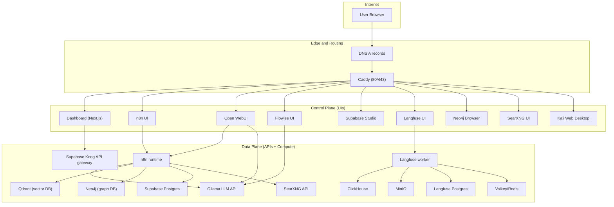
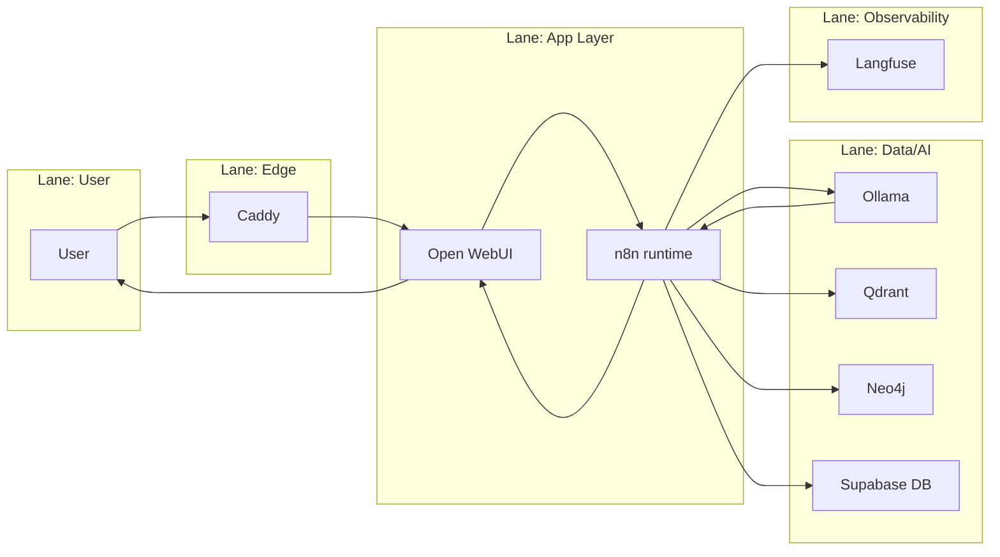
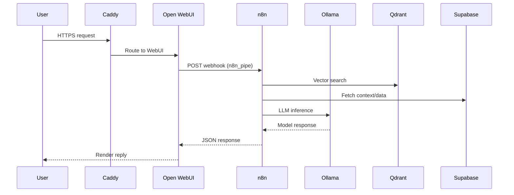
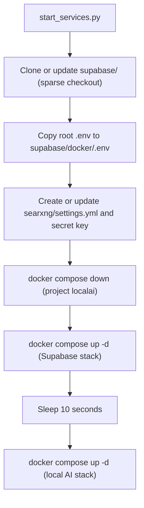

# CBass Architecture Map (Student Edition)

This document maps the services, ports, control planes, and data flows in CBass. It is designed to help a student understand how the system is structured and how requests move through it.

## Scope

- Covers the Docker Compose stack defined in `docker-compose.yml` and the Supabase stack included from `supabase/docker/docker-compose.yml`.
- Describes control plane (UIs and admin surfaces), data plane (runtime APIs and compute), observability plane, and ops plane.
- Includes diagrams and a port map for both private and public deployment modes.

## High-Level Overview

## Planes and Responsibilities

### Planes

- Control plane: human-facing UIs and admin tools.
- Data plane: service APIs and runtime compute.
- Observability plane: tracing, logging, and analytics.
- Ops plane: deployment scripts and update hooks.

### Plane Map

| Plane | Services | Notes |
|---|---|---|
| Control plane | Dashboard, n8n UI, Open WebUI, Flowise UI, Supabase Studio, Langfuse UI, Neo4j Browser, SearXNG UI, Kali Web | Mostly accessed through Caddy hostnames |
| Data plane | n8n runtime, Ollama, Qdrant, Neo4j, Supabase Kong, Supabase Postgres, Redis, SearXNG API | Internal container network `localai_default` |
| Observability | Langfuse worker+web, ClickHouse, MinIO | Tracing and event storage |
| Ops | `start_services.py`, `docker compose`, `updater` webhook | Deployment and update control |

## Service Catalog (Core Stack)

Legend:
- Internal port: container port on the Docker network.
- External: how it is reachable from outside.
- Storage: where persistent data lives (volume or bind mount).

| Service | Container | Internal port(s) | External access | Storage | Notes |
|---|---|---|---|---|---|
| Caddy | `caddy` | 80, 443, 2019 | Public 80/443 | `caddy-data`, `caddy-config` | Front door with TLS and routing |
| Dashboard | `dashboard` | 3000 | `cbass.space` | built in container | UI hub, uses Supabase auth |
| n8n | `n8n` | 5678 | `N8N_HOSTNAME` or `:8001` | `n8n_storage`, `./n8n/backup`, `./shared` | Workflow engine |
| Open WebUI | `open-webui` | 8080 | `WEBUI_HOSTNAME` or `:8002` | `open-webui` | Chat UI; can call n8n via `n8n_pipe.py` |
| Flowise | `flowise` | 3001 | `FLOWISE_HOSTNAME` or `:8003` | `~/.flowise` | Visual AI builder |
| Ollama | `ollama` | 11434 | `OLLAMA_HOSTNAME` or `:8004` | `ollama_storage` | Local LLM server |
| Qdrant | `qdrant` | 6333, 6334 | Internal only by default | `qdrant_storage` | Vector database |
| Neo4j | `neo4j` | 7473, 7474, 7687 | `NEO4J_HOSTNAME` or `:8008` | `./neo4j/*` | Graph database |
| Langfuse web | `langfuse-web` | 3000 | `LANGFUSE_HOSTNAME` or `:8007` | depends on worker/DB | Observability UI |
| Langfuse worker | `langfuse-worker` | 3030 | Internal only by default | depends on DB/MinIO | Background ingestion |
| ClickHouse | `clickhouse` | 8123, 9000, 9009 | Internal only by default | `langfuse_clickhouse_data`, `langfuse_clickhouse_logs` | Analytics storage |
| MinIO | `minio` | 9000, 9001 | Internal only by default | `langfuse_minio_data` | S3-compatible storage |
| Redis (Valkey) | `redis` | 6379 | Internal only by default | `valkey-data` | Cache used by Langfuse |
| SearXNG | `searxng` | 8080 | `SEARXNG_HOSTNAME` or `:8006` | `./searxng` | Metasearch |
| Kali Web | `kali` | 6901 | `KALI_HOSTNAME` or `:8009` | `kali-data`, `kali-tools` | Web desktop for learning |
| Updater | `updater` | 9000 | Internal only by default | `./scripts` | Webhook-driven updates |

## Service Catalog (Supabase Stack)

Supabase is auto-cloned into `supabase/` and uses its own compose file. Key containers and ports are summarized here.

| Service | Container | Internal port(s) | External access | Notes |
|---|---|---|---|---|
| Kong | `kong` | 8000, 8443 | `SUPABASE_HOSTNAME` or `:8005` | API gateway for Supabase |
| Postgres | `db` | 5432 | Internal by default | Main Supabase database |
| Auth | `auth` | 9999 | Internal by default | GoTrue auth service |
| REST | `rest` | 3000 | Internal by default | PostgREST API |
| Realtime | `realtime` | 4000 | Internal by default | WebSocket subscriptions |
| Storage | `storage` | 5000 | Internal by default | File storage API |
| Studio | `studio` | 3000 | Usually proxied via Kong | Supabase UI |
| Meta | `meta` | 8080 | Internal by default | Postgres meta API |
| Pooler | `supavisor` | 6543 | Internal by default | Connection pooler |
| Analytics | `analytics` | 4000 | Internal by default | Logflare/analytics |
| Edge functions | `functions` | 9000 | Internal by default | Edge runtime |
| Image proxy | `imgproxy` | 8080 | Internal by default | Image transformation |

## Port Map

### Internal ports (Docker network)

| Service | Port(s) | Purpose |
|---|---|---|
| Caddy | 80, 443 | Edge routing |
| Dashboard | 3000 | UI |
| n8n | 5678 | Workflow UI and API |
| Open WebUI | 8080 | Chat UI |
| Flowise | 3001 | UI |
| Ollama | 11434 | LLM API |
| Qdrant | 6333/6334 | Vector DB HTTP/gRPC |
| Neo4j | 7474/7687 | Browser/Bolt |
| Langfuse web/worker | 3000/3030 | UI + worker |
| ClickHouse | 8123/9000/9009 | Analytics DB |
| MinIO | 9000/9001 | S3 + console |
| Redis | 6379 | Cache |
| SearXNG | 8080 | Search |
| Kali | 6901 | Web desktop |
| Updater | 9000 | Webhook |

### External exposure by environment

- Private mode (`--environment private`): services are bound to `127.0.0.1` ports via `docker-compose.override.private.yml` for local access, plus Caddy 80/443.
- Public mode (`--environment public`): only Caddy 80/443 should be exposed. Supabase port bindings are removed via `docker-compose.override.public.supabase.yml`.
- Production domain routing: hostnames like `N8N_HOSTNAME`, `WEBUI_HOSTNAME`, etc are proxied by Caddy to internal services.

## Swim Lane: Chat Request Through the System

## Sequence Diagram: Open WebUI to n8n RAG Flow

## Flowchart: Startup Sequence

## Control Plane Surfaces (UIs)

| UI | Purpose | Access |
|---|---|---|
| Dashboard | Service hub and auth | `cbass.space` |
| n8n UI | Workflow creation and management | `N8N_HOSTNAME` |
| Open WebUI | Chat UI for LLMs | `WEBUI_HOSTNAME` |
| Flowise UI | Visual AI builder | `FLOWISE_HOSTNAME` |
| Supabase Studio | DB/admin UI | usually via `SUPABASE_HOSTNAME` |
| Langfuse UI | Tracing and observability | `LANGFUSE_HOSTNAME` |
| Neo4j Browser | Graph exploration | `NEO4J_HOSTNAME` |
| SearXNG UI | Search interface | `SEARXNG_HOSTNAME` |
| Kali Web Desktop | Learning environment | `KALI_HOSTNAME` |

## Data Plane Endpoints (Internal DNS)

Examples of internal DNS usage from within containers:

- `http://ollama:11434` for LLM inference.
- `http://qdrant:6333` for vector search.
- `bolt://neo4j:7687` for graph queries.
- `postgres://postgres@db:5432` for n8n to Supabase DB.
- `http://searxng:8080` for search.
- `http://minio:9000` and `http://clickhouse:8123` for Langfuse storage.

## Storage and Persistence

### Named volumes

- `n8n_storage` for n8n state.
- `ollama_storage` for downloaded models.
- `qdrant_storage` for vector data.
- `open-webui` for WebUI data.
- `flowise` for Flowise data.
- `caddy-data` and `caddy-config` for TLS and config.
- `valkey-data` for Redis.
- `langfuse_postgres_data`, `langfuse_clickhouse_data`, `langfuse_clickhouse_logs`, `langfuse_minio_data`.
- `kali-data`, `kali-tools` for the Kali environment.

### Bind mounts

- `./n8n/backup` for workflow imports.
- `./shared` for shared files accessible in n8n.
- `./neo4j/*` for Neo4j data/logs/plugins.
- `./searxng` for SearXNG config.

## Control and Ops Tools

| Tool | Role | Where |
|---|---|---|
| `start_services.py` | Bootstraps Supabase, SearXNG, and stack start | repo root |
| `docker compose` | Lifecycle management | repo root |
| `Caddyfile` | Hostname routing | repo root |
| `scripts/update-container.sh` | Update webhook target | `scripts/` |
| `Scripts/hooks.json` | Webhook config for updates | `Scripts/` |

## Recommendations

1. Security hardening
   - Ensure public mode is used in production so only Caddy 80/443 are exposed.
   - If Kong/pooler ports are exposed, restrict them with firewall rules or remove port mappings.
   - Change the default Kali VNC password and restrict access by hostname or auth.
2. Resource and stability
   - Add CPU/memory limits for heavy services (Ollama, Qdrant, Neo4j, ClickHouse).
   - Pin image tags to known-good versions instead of `latest` for predictable upgrades.
   - Use healthcheck-based dependencies to avoid race conditions on startup.
3. Data safety
   - Schedule backups for Supabase Postgres, Langfuse Postgres, and Qdrant volumes.
   - Document a restore procedure and practice it.
4. Observability
   - Enable centralized logging (e.g., a log shipper) so container logs persist.
   - Create a basic dashboard: request rate, errors, and latency for Caddy and n8n.
5. Student-friendly improvements
   - Add a short "first lab" checklist in the README: test Open WebUI, run a simple n8n workflow, verify Qdrant and Neo4j connections.
   - Provide a prebuilt n8n workflow that demonstrates RAG and logs to Langfuse.

## Suggested Reading Paths for Students

1. Start with the "High-Level Overview" diagram to learn the layers.
2. Study the "Service Catalog" tables to understand who owns each role.
3. Trace a request with the "Swim Lane" and "Sequence" diagrams.
4. Review "Ports" and "Storage" to see what is internal vs external.
